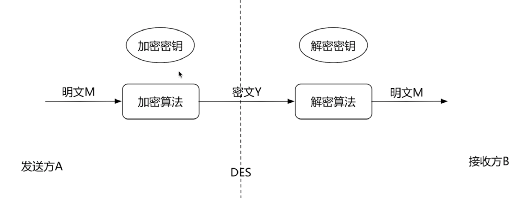
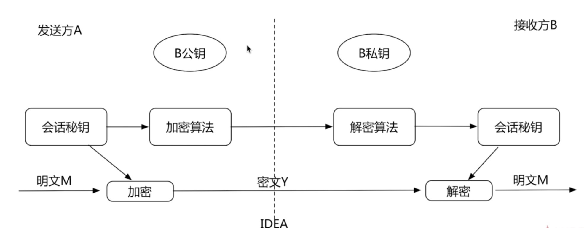
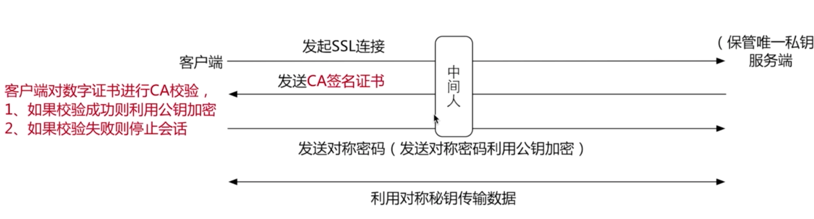

### 对称加密

 

### 非对称加密

 

### CA证书

 

**步骤**

 1、生成key 密钥 

 2、生成证书请求文件(csr文件)

 3、生成证书签名文件(CA文件)

```
openssl genrsa -idea -out jesonc.key 1024
openssl req -new -key jesonc.key -out jesonc.csr
openssl x509  -req -days 3650 -in jesonc.csr -signkey jesonc.key -out jesonc.crt
```

```
Syntax:ssl on|off;
Default:ssl off;
Context:http,server;

Syntax:ssl_certificate file;
Default:-;
Context:http,server;

Syntax:ssl_certificate_key file;
Default:-;
Context:http,server;
```

```
ssl on;
ssl_certificate /usr/local/openresty/nginx/conf/ssl_key/jesonc.crt;
ssl_certificate_key /usr/local/openresty/nginx/conf/ssl_key/jesonc.key;
```
重新加载
```
sudo /usr/local/openresty/nginx/sbin/nginx -s stop
sudo /usr/local/openresty/nginx/sbin/nginx
sudo /usr/local/openresty/nginx/sbin/nginx -s reload
```

```
openssl rsa  -in ./jesoncold.key -out ./jesonc_nopass.key
```

**生成苹果要求的证书**

1、服务器所有的链接使用TLS1.2以上版本(openssl 1.0.2)

2、HTTPS证书必须使用SHA256以上哈希算法签名

3、HTTPS证书必须使用RSA 2048位 或者ECC 256位以上公钥算法

4、使用向前加密技术


```
openssl req -days 36500 -x509 -sha256 -nodes -newkey rsa:2048 -keyout jesonc.key -out jesonc_apple.crt
```

```
ssl on;
ssl_certificate /usr/local/openresty/nginx/conf/ssl_key/jesonc_apple.crt;
ssl_certificate_key /usr/local/openresty/nginx/conf/ssl_key/jesonc.key;
```

### https 优化
激活 keepalive 长链接

设置ssl session缓存

```
keepalive_timeout 100;
ssl_session_cache shared:SSL:10m;
ssl_session_timeout 10m;
```


