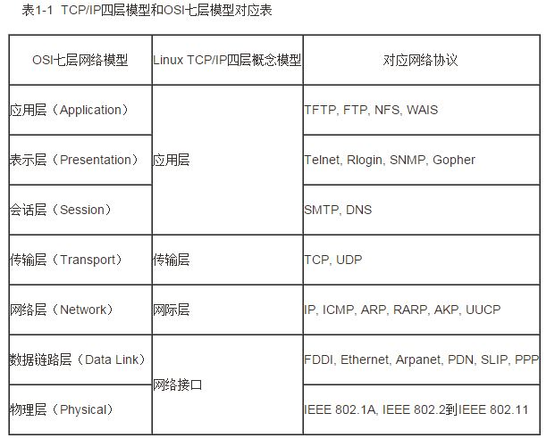

### 1、分层
七层网络架构、四层网络架构；三次握手，四次挥手
七层：物理层、数据链路层、网络层、传输层、会话层、表示层、应用层
四层：链路层、网络层、传输层、应用层


### 2、nginx、openresty  介绍


**select、poll、epoll**

```
select 轮询
poll、epoll 主动上报
```


nginx安装** 

http://nginx.org/en/linux_packages.html

**openresty安装**

```
#安装常用工具
yum -y install gcc  glibc-static telnet bridge-utils net-tools gcc-c++ autoconf pcre pcre-devel make automake  wget httpd-tools vim
```

```
#添加yum源
sudo yum-config-manager --add-repo https://openresty.org/yum/cn/centos/OpenResty.repo

```


```
sudo yum -y install openresty
```


### 3、http常用状态码

| 状态码 | 描述                                                         | 解决方法                       |
| ------ | ------------------------------------------------------------ | ------------------------------ |
| 200    | 正常响应                                                     |                                |
| 304    | 正常响应，使用客户端缓存                                     |                                |
| 301    | 永久重定向                                                   |                                |
| 302    | 临时重定向                                                   |                                |
| 404    | 资源找不到                                                   |                                |
| 413    | 上传的文件过大                                               | 调整 client_max_body_size 大小 |
| 401    | 未授权: 由于凭据无效，访问被拒绝                             |                                |
| 502    | bad gateway     后端服务挂了，完全没有响应。网络问题也会导致后端服务没有响应 | 检查后端服务                   |
| 504    | gateway timeout 后端服务存活，响应超时了。网络问题也会导致后端服务响应超时 | 检查后端服务，查看超时服务     |
| 503    | 请求数过多,服务器过载                                        |                                |

### 4、虚拟主机配置

**查看nginx日志**

nginx

/var/log/nginx/access.log

/var/log/nginx/error.log


openresty

/usr/local/openresty/nginx/logs/access.log

/usr/local/openresty/nginx/logs/error.log


**虚拟主机**

```
http{
	server{
		root /opt/nginx/appp/code;
		location /{
		}
	}
	
}
```


### 5、 跨站访问

**add_header**

```
Syntax：add_header name value [always];
Default:-
Context:http,server,location,if in location
```

**Access-Control-Allow-Origin**

示例


Web1 请求 web2

Web2

```
add_header Access-Control-Allow-Origin  http://web1.com;
add_header Access-Control-Allow-Methods POST,GET,PUT,OPTIONS,DELETE;
```


使用jsonp 跨站访问补充  http://justcoding.iteye.com/blog/1366102

### 6、正向代理、反向代理

**proxy_pass**

```
Syntax:  proxy_pass URL;
Default:-
Context:location,if in location,limit_except
```


### 7、负载均衡

配置语法

```
Syntax  :upstream name  {...}
Default:-
Context  http
```

**upstream详细说明**

```
upstream test {
	server 172.17.0.2 down;
	server 172.17.0.3 backup;
	server 172.17.0.4;
}
```

```
down  			当前的server暂时不参与负载均衡
backup			预留的备份服务
max_fails		允许请求的失败的次数
fail_timeout	经过max_fails失败后，服务暂停时间
max_conns		限制最大的接收的连接数
```


**调度算法**

```
轮询			按时间顺序逐一分配不同的后端服务器
加权轮询 		weight值越大，分配到的访问几率越高
ip_hash			每个请求按访问IP的hash结果分配，这样来自同一个IP的固定访问一个后端服务器
url_hash			按照访问的URL的hash结果来分配请求，是每个URL定向到一个后端服务器	
least_conn 		最少链接数，哪个机器连接数少就分发
hash关健数值 	hash自定义的key
```

**查看负载到了哪一台机器**

```
add_header Nginx-Cache "$upstream_cache_status";
add_header backendIP $upstream_addr;
```

```
add_header		  为响应时增加header
proxy_set_header  为请求时增加header
```

### 8、https

**加密两种方式**

```
对称加密
非对称加密
```

**CA证书**

**步骤**

```
 1、生成key 密钥
 2、生成证书请求文件(csr文件)
 3、生成证书签名文件(CA文件)
```

**生成苹果要求的证书**

```
1、服务器所有的链接使用TLS1.2以上版本(openssl 1.0.2)
2、HTTPS证书必须使用SHA256以上哈希算法签名
3、HTTPS证书必须使用RSA 2048位 或者ECC 256位以上公钥算法
4、使用向前加密技术
```

